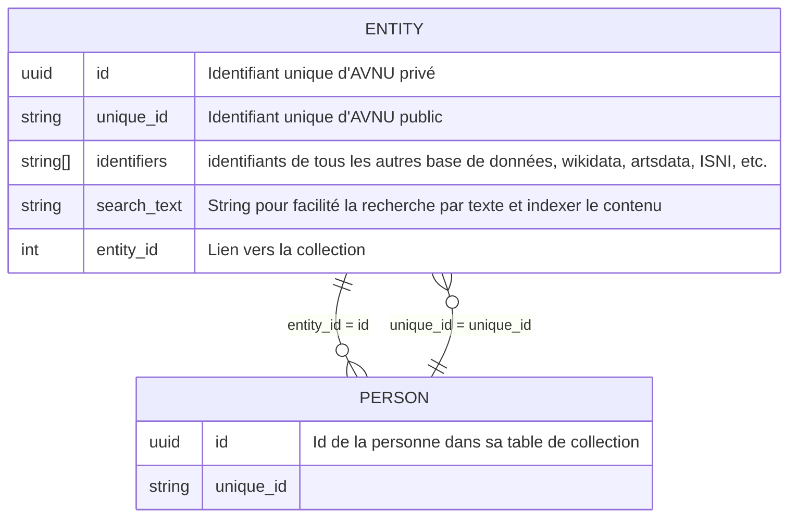

tag : #documentation_technique 

# Objectifs
Définir l'identifiant unique des entités dans la BDSOL
Permettre la liaison d'autres identifiant unique dans la BDSOL

# [[Brainstorm]] pour Identifiants

On voit 2 pistes de structure pour les préfixe

## Avec un préfix + un nombre incrémenté

### Pour les entités
`AN` + `2 premières lettres de l'entité` + `nombre incrémenté`
ANPE1 (pour la personne au id 1). ou ANPE179.
ANOR1 (pour l'organisation au id 1) ou ANOR179.
ANPR1 - projet
ANEV1 - événement
ANLI1 - lieu
ANEQ1 - équipement

### Pour les taxonomies
`AN`+`T`+`2 premières lettre de la taxonomie`+`nombre incrémental`
`ANTCO`

Si la taxonomie est un multi mots, c'est la première lettre des 2 premiers mots. Comme secteurs d'activités : 
`ANTSA1` pour `Internet par exemple` ou `ANTTE1` pour amplificateur (type d'équipement)
## Avec un préfix + une chaine de caractère unique
`AN` + `2 premières lettre de l'entité` + `chaine unique`
ANPE + chaine unique + directement le princpale ou un deuxième pour garde le id unique privé à l'env.

par exemple :



# [[Conception]] pour Identifiants


# Structure

```javascript

```

## Exemple

```javascript

```


# Todo


# Planifié
